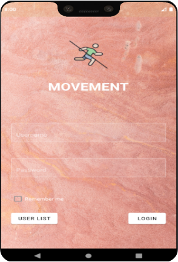

# Mobile Android app for master-thesis
<p align="center">
 
</p>

### Description

This project is part of my master thesis, which you can check [here](https://github.com/filipmacek/master-thesis).

Mobile Android app is a digital twin for users within our ecosystem `Movement`.
It helps the user execute routes and generates location data as the user moves.
After the user registers on the web app, smart contract writes data about user registration on a blockchain.
Then the user can access the mobile app with the username and password specified in the registration form.
Also, to get location data, the user needs to give permission to the Android app.
At startup, the application connects with  Infura RPC endpoint to Ethereum testnet Kovan and
takes all the data it needs for successful initialization.
After the user enters his username and password, the app checks if data matches with data it got from smart contract.
If the username and two times hashed password match, the app confirms identity of the user and permits him to
enter into a new Android fragment that will act as a dashboard.

On dashboard view are three different tabs.

#### Routes
List of all the available routes with start and end location points, status and descriptions.
Users can press the `INFO` button to check where these two points are on Google Maps.
If he wants to start this route, he will press `ACCEPT`

#### Nodes
It shows a list of registered Chainlink nodes with API addresses and URL endpoints, so the app knows where to send location data.
These nodes are EC2 servers running on Aws cloud. If it responds to pings, we will show a green box with a connected state.

#### Account
It shows personal data about users and their routes.

***

Here in the first picture, there are three routes, with all metadata and status. Some of them are available to users to complete, but
some of them are already completed.
In the second picture, we could see two nodes or Linux servers that act as `DataAdapter` for our Chainlink nodes.
Each node has an IP address, endpoint, and oracle address of the corresponding Chainlink oracle contract.
The goal was to simulate a decentralized oracle network with these two nodes.


<p align='center'>

</p>

<p align='center'>
<em>Picture 1.1: Mobile App Dashboard with tabs Routes and Nodes</em>
</p>


## Agent of smart contract

A particular object class called `Agent` in the mobile app is responsible for writing target data to smart contract.
It writes `StartRouteEvent` and `EndRouteEvent` data structs, and runs function `RequestRouteStatus`, so Chainlink nodes
can check if the user completed routes correctly.
Calling the smart contract function and writing all the data in the blockchain is done with the private key, which strictly belongs to `Agent`.
The private key is written in a special folder to be compiled in the app and kept secret.
> Because some functions in smart contract are only permitted to run by the Agent, we inserted at smart contract creation address of

> Agent, which belongs to this private key as a global variable.

Below, you can see the constructor of our Solidity smart contract `Movement` where he accepts the address of Agent, and corresponding modifier function
which we are using to restrict access to special functions only belonging to the Agent address.

```solidity
address private agent;

constructor(address _agent)public Ownable(){
      agent = _agent;
 }
    
// modifiers
modifier onlyAgent(){
    require(msg.sender == agent);
     _;
}
    
```

## How does it work

After the user has accepted the route, a new Android fragment opens up and a new process starts to run and collect
location GPS data from the mobile phone in the background.
After each location change, we will send a new location data point to the `Data Adapter` IP address of the Chainlink node.
Let's describe pars of this view.
#### Dashboard
This dashboard is the primary tool for users running routes. It has all the relevant data that which user needs to complete the selected route safely:
- current location and number of location changes generated by background location process
- status of routes, time, speed, and traveled distance
- information if the start and end location is visited
- Status of Chainlink nodes, activity, IP address, and how many location changes they received

#### Map
Google Maps, which shows start and end location data points with pinpoint. Also, around each location point, there is a circle with
the radius of 21 meters is a condition we set up to acknowledge that the user did visit this point.


<p align='center'>

</p>

<p align='center'>
<em>Picture 2.2: Live route layout and notification when finished</em>
</p>


The application will notify the user when he completes the route, which means first visiting start location and then an end location.
All the data will be sent to `DataAdapter` of Chainlink nodes, and we will write `EndRouteEvent` on the blockchain as a confirmation
that user did visit the end location.
The smart contract will then start to parse and process location data with the help of Chainlink node and write results to blockchain.


## Live
Here you could see GIFs from each state change when user started executing route.

### 2. At start
When the user starts executing the route, the program first checks if the user has visited the start location.
<p align='center'>
  
</p>


### 3. During the execution of route
Here you can see how the user is approaching the end location in this fast-forwarded gif.
As the user walks, location changes are recorded on the Android app, which sends these data points to `DataAdapter` IP address
of the Chainlink node.
<p align='center'>
  
</p>


### 4. At the end
In the last phase of route execution, we wait for the user to visit the end location.
After he is in a radius of 20m from the end data point, the app exits from route execution dashboard and notifies user, \
In the background, our `Agent` entity notifies the smart contract on the blockchain that the route is finished.
<p align='center'>
  
</p>
